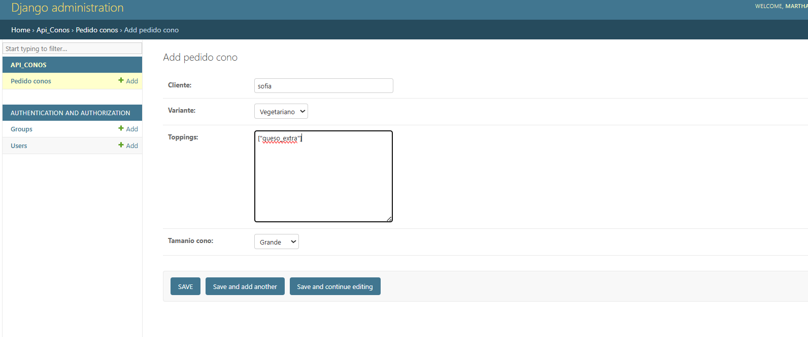
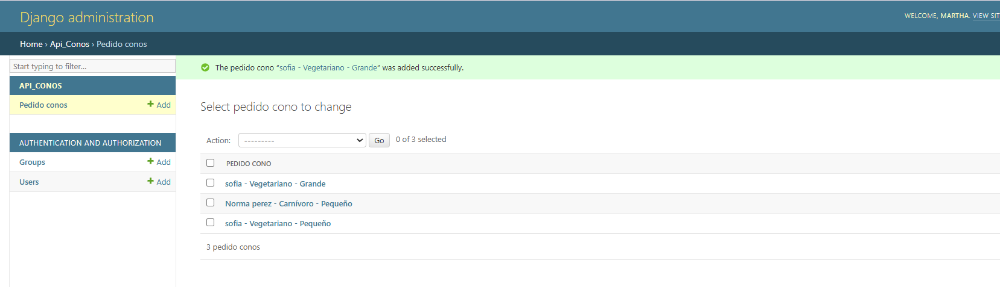
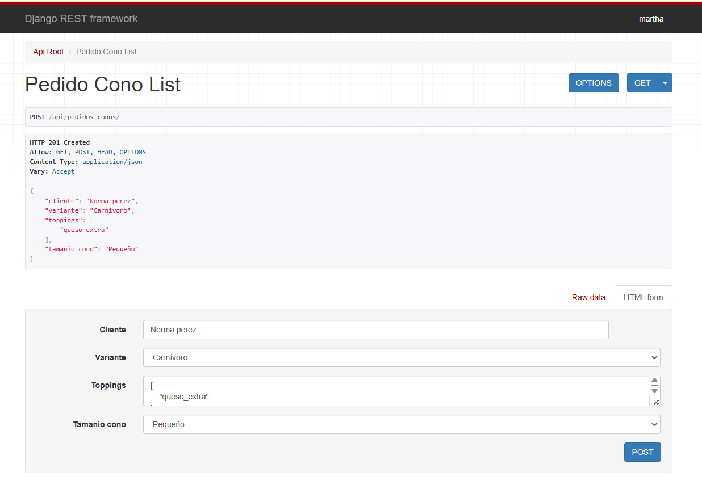
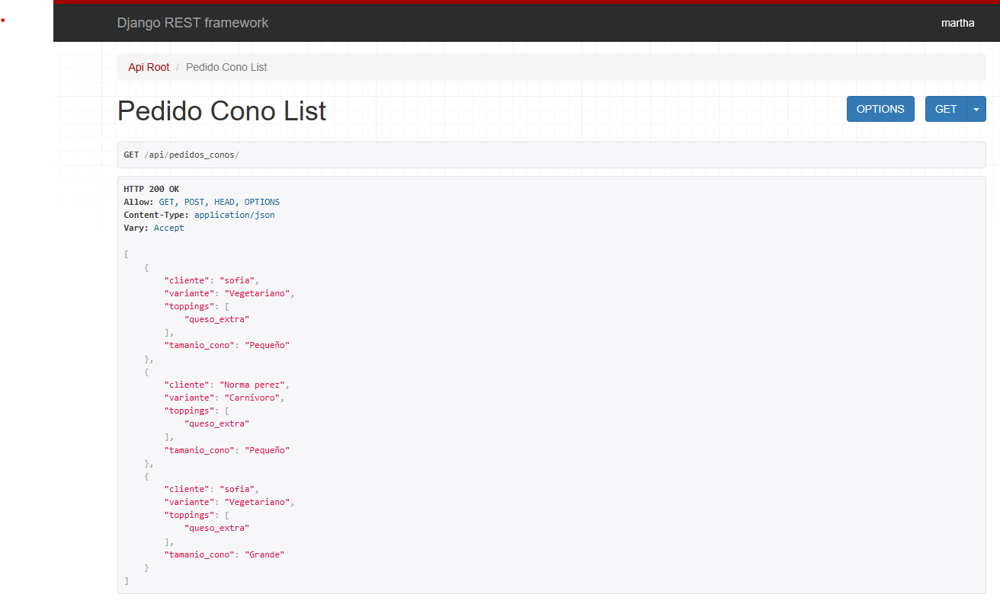

# pg2_parcial2
### API Pedidos para Negocio de Conos

**Nombre:** Martha Gonzales
**Curso:** Segundo  
**Materia:** Programacion II
**Fecha:** 7 de julio de 2025

## Descripción

Este proyecto implementa una API REST con Django y Django REST Framework para gestionar pedidos de conos personalizados en un negocio de comida rápida. Se incorporan patrones de diseño como Factory Method, Builder y Singleton para calcular dinámicamente atributos personalizados dentro del serializador.

### Pasos a seguir
-clonar repositorio
-.gitignore
-requirements.txt
-activar entorno virtual con `python -m venv env`
 -`.-\env\Scripts\activate`

### Instalar dependencias:
-pip install django djangorestframework
-pip install -r requirements.txt

### Crear el proyecto y la app:
django-admin startproject api_patrones .
python manage.py startapp api_conos

### Configurar la base de datos en settings.py para usar SQLite
INSTALLED_APPS = [
    ...
    'rest_framework',
    'api_conos',
]

#### Modelo de Datos
Se implementó el modelo PedidoCono con los siguientes campos:
- cliente: Nombre del cliente.
- variante: Tipo de cono (Carnívoro, Vegetariano, Saludable).
- toppings: Lista en formato JSONField con toppings adicionales.
- tamanio_cono: Tamaño del cono (Pequeño, Mediano, Grande).
- fecha_pedido: Fecha automática del registro.
Además:
- El modelo está registrado en el admin de Django.

### Serializador + ViewSet

Se creó un PedidoConoSerializer con los campos estándar y una validación para los toppings.
Se añadieron dos atributos calculados:
- precio_final: Calculado dinámicamente utilizando lógica con patrones.
- ingredientes_finales: Lista final generada del cono personalizado.
El ViewSet correspondiente expone el endpoint en: api/pedidos_conos/

## Aplicación de Patrones de Diseño
Se aplicaron los siguientes patrones:

## Aplicación de Patrones de Diseño

En este proyecto se implementan varios patrones de diseño para mejorar la mantenibilidad, escalabilidad y claridad del código:

### 1. Factory Method

Se utilizo este patron Factory para encapsular la creacion de distintas bases de cono (Caaarnivoro, Vegetariano y Saludable). El codigo esta implementado en el archivo `api_conos/factory.py`.
```python
from api_conos.modelos_conos import ConoCarnivoro, ConoVegetariano, ConoSaludable

class ConoFactory:
    @staticmethod
    def crear_cono(variante, tamanio):
        opciones = {
            'carnivoro': ConoCarnivoro,
            'vegetariano': ConoVegetariano,
            'saludable': ConoSaludable,
        }
        clave = variante.lower().replace('í', 'i')
        clase_cono = opciones.get(clave)
        if clase_cono is None:
            raise ValueError(f"Variante desconocida: {variante}")
        return clase_cono(tamanio)
```
### 2. Builder
Se utilizo este patron ya que es el encargado de construir el pedido personalizado, agregar el tamaño del cono y añadir los toppings, actualizando tanto el precio como la lista de ingredientes. Ideal para mantener una arquitectura limpia y flexible.
El codigo esta implementado en el archivo `api_conos/builder.py`.

```python
from .logger import LoggerSingleton

class ConoBuilder:
    def __init__(self, cono):
        self.cono = cono
        self.logger = LoggerSingleton()

    def agregar_toppings(self, toppings):
        self.cono.ingredientes.extend(toppings)
        self.cono.precio += len(toppings) * 2
        return self

    def resultado(self):
        self.logger.log(f"Cono construido: ${self.cono.precio} - {self.cono.ingredientes}")
        return self.cono
```
---
### 3. Singleton

Este patrón asegura que solo exista una instancia compartida de la clase Logger a lo largo de toda la aplicación, permitiendo registrar eventos importantes como el cálculo de precios o la composición final del pedido de café.
El codigo esta implementado en el archivo `api_conos/logger.py`.
````python
import datetime

class LoggerSingleton:
    _instance = None
    _logs = []

    def __new__(cls):
        if cls._instance is None:
            cls._instance = super(LoggerSingleton, cls).__new__(cls)
        return cls._instance

    def log(self, mensaje):
        timestamp = datetime.datetime.now().isoformat()
        self._logs.append(f"[{timestamp}] {mensaje}")

    def obtener_logs(self):
        return self._logs
````
---
### Rutas y endopoints

- Endpoint para listar y crear pedidos: http://localhost:8000/api/pedidos_conos/
- Administración: http://localhost:8000/admin/

### Pruebas y verificacion
capturas de pantalla de la interfaz de registro de datos en el
administrador de Django y de la lista de registros en el endpoint de API REST
con los atributos calculados y sus valores.

### Capturas de pantalla de la interfaz de registro de datos en el
administrador de Django

----

-----
### Capturas de pantalla de la lista de registros en el endpoint de API REST con los atributos calculados y sus valores.
administrador de Django

-----

